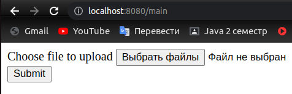
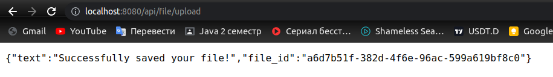
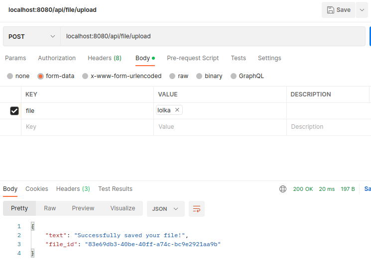

# Тестовое задание для Go разработчика в DeNet

### Запуск сервиса

Для запуска сервиса введите в терминал команду `make run`
Если по какой-либо причине команда `make run` не работает, выполните
данную команду для запуска сервиса:
```
 go run cmd/main.go
```

### Тестирование сервиса

1. Чтобы загрузить файл на сервер, вы можете воспользоваться удобным интерфейсом 
по адресу: (Не забудьте сохранить UUID, он вам пригодится на **шаге 3**)
```
localhost:8080/main
```

**Пример запроса**

`localhost:8080/main`

<br>



<br>




<br>

2. Если вы хотите самостоятельно поработать с handler`ом для получения файла
тогда вам нужно воспользоваться данным адресом:
```
localhost:8080/api/file/upload
```

**Пример запроса**

`localhost:8080/api/file/upload`



3. Чтобы скачать ранее загруженный файл перейдите по данному адресу, вставив
в конце (вместо `{name}`) ваш UUID полученный на шаге 1 или 2:
```
localhost:8080/api/file/download/{name}
```
Файл успешно скачается с тем же названием, с которым вы его загружали.

***Также для вашего удобства в корне проекта есть файл `requests.http`
в котором продублированы все URL***